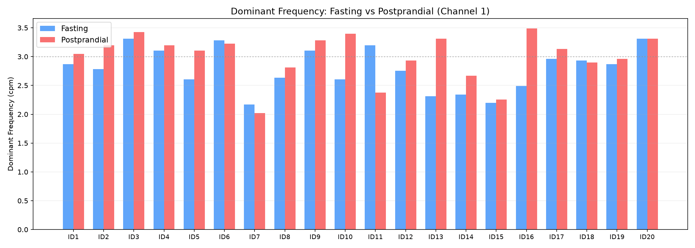
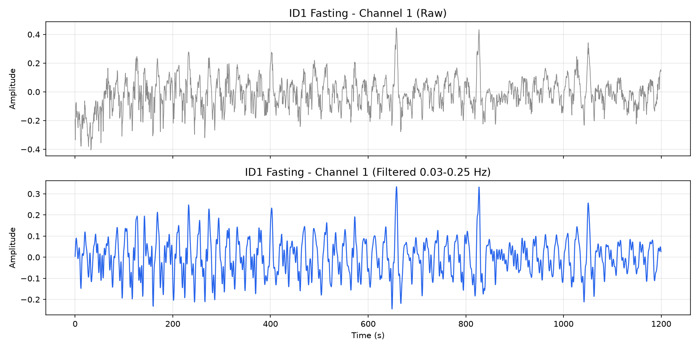
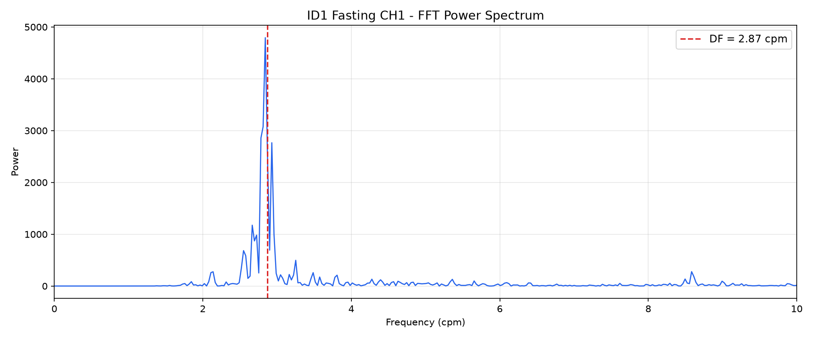
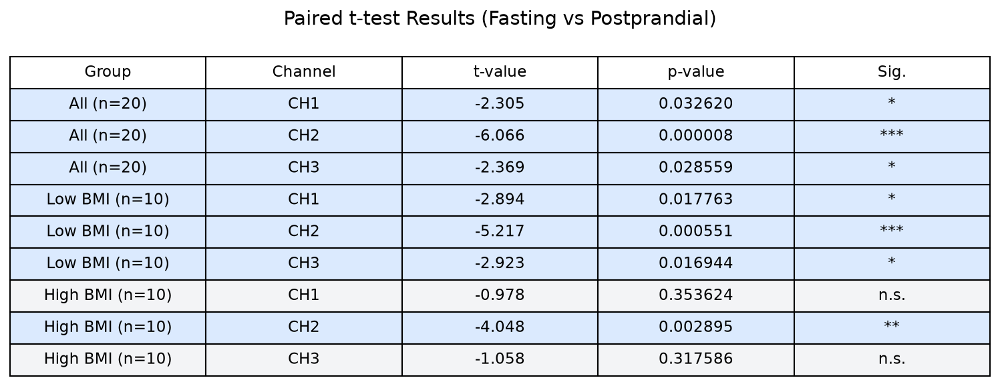

# EGG Analysis

Python reproduction of electrogastrogram (EGG) analysis methods.

GitHub link: [https://github.com/chelsea12306/EGG_Analysis](https://github.com/chelsea12306/EGG_Analysis)

## 1. EGG-database overview

This dataset is from **Three-channel surface electrogastrogram (EGG) dataset recorded during fasting and post-prandial states in 20 healthy individuals**.

Dataset link: [https://zenodo.org/records/3878435](https://zenodo.org/records/3878435)

| Item | Description |
| --- | --- |
| Subjects | 20 healthy adults (ID1 - ID20) |
| Recording conditions | Two recordings per subject: fasting and postprandial |
| Channels | 3 channels per recording (CH1, CH2, CH3) |
| Sampling rate | 2 Hz |
| Amplification | 1000 |
| Duration | 20 minutes (2400 samples × 3 channels = 7200 data points) |
| File naming | `ID{N}_fasting.txt` and `ID{N}_postprandial.txt` |

Each `.txt` file has 3 columns (CH1, CH2, CH3) with 2400 rows (representing 20 minutes).

## 2. eggAnalysis.py functionality

`eggAnalysis.py` performs the following tasks.

### 2.1 Signal preprocessing

- Load fasting and postprandial EGG data for 20 subjects (40 files total).
- Apply a **3rd-order Butterworth bandpass filter** (0.03–0.25 Hz, zero-phase filtering via `filtfilt`) to each channel.
- Use only the first 2400 samples to ensure uniform input length across subjects.

### 2.2 Dominant frequency (DF) calculation

- Compute **4096-point FFT** for each channel.
- Compute one-sided power spectrum `|FFT|²`.
- Identify the peak frequency as the dominant frequency (DF).
- Convert frequency from Hz to **cpm (cycles per minute)**.

### 2.3 Manual corrections

- The original authors visually inspected all peaks and identified 8 incorrectly detected DF values.
- 8 correction values are hardcoded in the script (covering ID4, ID6, ID15, ID17).

### 2.4 Statistical analysis

- Perform **paired t-tests** for each channel (fasting vs postprandial).
- Split subjects into lower-BMI and higher-BMI groups for separate testing.
- Output p-values and test decisions `h` (`h=1` means significant at alpha=0.05).

### 2.5 Output

Generate `df.csv`: a 20-row × 6-column EGG dominant frequency matrix.

## 3. df.csv structure and interpretation

`df.csv` is the core output of the analysis.

| Row | Column | Meaning |
| --- | --- | --- |
| 20 Row | — | Corresponds to 20 subjects (ID1 - ID20) |
| — | Cols 1–3 | Fasting DF for CH1, CH2, CH3 (cpm) |
| — | Cols 4–6 | Postprandial DF for CH1, CH2, CH3 (cpm) |



*Figure 1: Fasting vs postprandial dominant frequency for all subjects (Channel 1)*

### 3.1 Physiological meaning of the values

- **cpm (cycles per minute):** the number of gastric slow-wave oscillations per minute.
- Normal gastric slow wave is approximately **3 cpm** (normal range: 2.0–4.0 cpm).
- **Fasting vs postprandial:** after a meal, the stomach increases its contraction rate to digest food, so postprandial EGG dominant frequency is typically higher than fasting.
- Comparing the two quantifies gastric motility response.

### 3.2 Statistical results summary

The code performs 9 paired t-tests:

| Group | CH1 | CH2 | CH3 |
| --- | --- | --- | --- |
| All subjects | p = 0.033 * | p < 0.001 *** | p = 0.029 * |
| Lower BMI | p = 0.018 * | p < 0.001 *** | p = 0.017 * |
| Higher BMI | p = 0.354 (n.s.) | p = 0.003 ** | p = 0.318 (n.s.) |

## 4. eggVisualization.py functionality

`eggVisualization.py` is a standalone visualization script that displays analysis results as figures. It does not run automatically; execute it separately after `eggAnalysis.py`:

```python
%run eggVisualization.py
```

The script generates the following figures.

### 4.1 Raw vs filtered signal



*Figure 2: ID1 fasting CH1 raw signal (top) vs 0.03–0.25 Hz bandpass filtered signal (bottom)*

**Meaning:** The raw signal (top) contains high-frequency noise and motion artifacts. After bandpass filtering (bottom), the gastric slow-wave rhythm (~3 cpm) is preserved, producing a smoother signal suitable for FFT analysis.

### 4.2 FFT power spectrum with DF annotation



*Figure 3: FFT power spectrum of ID1 fasting CH1, with the automatically detected dominant frequency marked by a red dashed line*

**Meaning:** The x-axis is frequency (cpm), y-axis is power. The highest peak corresponds to the dominant frequency (DF). This figure validates the 2.87 cpm result.

### 4.3 Fasting vs postprandial DF bar chart

**Meaning:** Visualizes the dominant frequency difference between fasting and postprandial states for Channel 1 across all 20 subjects. Most subjects show higher postprandial DF (red) compared to fasting (blue), consistent with the statistical test results.

### 4.4 t-test results summary table



*Figure 4: Summary of 9 paired t-test results (significance markers: * p<0.05, ** p<0.01, *** p<0.001)*

**Meaning:** The table summarizes t-values, p-values, and significance for all three groups (all, lower-BMI, higher-BMI) across 3 channels. Blue background indicates significance (p < 0.05), gray indicates not significant.

## 5. How to run

1. Extract `EGG-database.zip` into the `EGG-database/` folder.
2. Run `eggAnalysis.py` to generate `df.csv`.
3. Run `eggVisualization.py` to generate 4 analysis figures.

---

*Generated for EGG Analysis Project · Based on https://zenodo.org/records/3878435*
